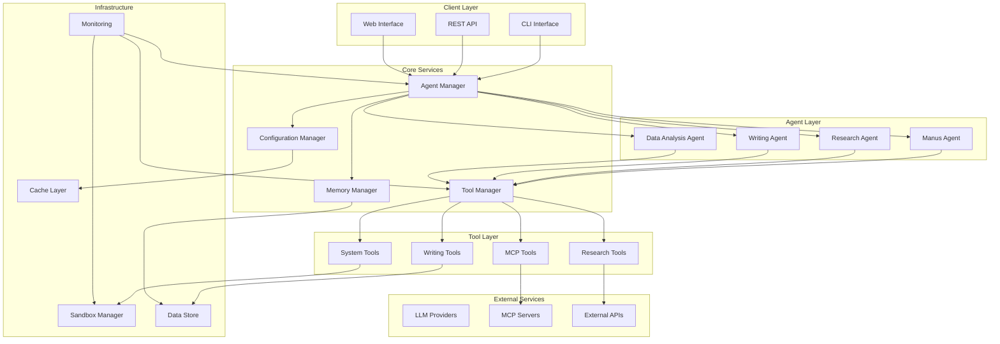
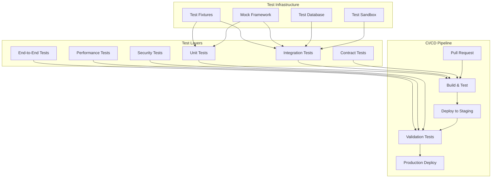

# Production-Ready OpenManus Design Document

## Overview

This design document outlines the architecture and implementation approach for transforming OpenManus into a production-ready AI agent framework with enhanced research and writing capabilities. The design focuses on reliability, scalability, security, and advanced features while maintaining the existing tool-based architecture.

## Architecture

### High-Level Architecture



### Core Components

#### 1. Enhanced Agent Manager
- **Purpose**: Orchestrate agent lifecycle, handle concurrent requests, manage agent state
- **Key Features**:
  - Agent pool management for concurrent operations
  - Request routing and load balancing
  - Health monitoring and automatic recovery
  - Circuit breaker pattern for external dependencies

#### 2. Robust Tool Manager
- **Purpose**: Manage tool lifecycle, handle tool failures, provide tool discovery
- **Key Features**:
  - Dynamic tool registration and discovery
  - Tool dependency management and version control
  - Automatic retry logic with exponential backoff
  - Tool performance monitoring and caching

#### 3. Advanced Memory Manager
- **Purpose**: Efficient memory management, conversation persistence, context optimization
- **Key Features**:
  - Hierarchical memory structure (short-term, long-term, semantic)
  - Automatic memory compression and summarization
  - Context window optimization for LLM calls
  - Conversation branching and versioning

#### 4. Configuration Manager
- **Purpose**: Centralized configuration management with validation and hot reloading
- **Key Features**:
  - Schema-based configuration validation
  - Environment-specific configuration overlays
  - Hot reloading without service interruption
  - Configuration versioning and rollback

## Components and Interfaces

### 1. Error Handling System

```python
class ErrorHandler:
    """Centralized error handling with context preservation"""

    async def handle_error(
        self,
        error: Exception,
        context: ErrorContext,
        recovery_strategy: RecoveryStrategy = RecoveryStrategy.RETRY
    ) -> ErrorResult

    async def implement_circuit_breaker(
        self,
        service: str,
        failure_threshold: int = 5,
        recovery_timeout: int = 60
    ) -> CircuitBreaker

class RetryManager:
    """Intelligent retry logic with exponential backoff"""

    async def retry_with_backoff(
        self,
        operation: Callable,
        max_retries: int = 3,
        base_delay: float = 1.0,
        max_delay: float = 60.0
    ) -> Any
```

### 2. Enhanced Research System

```python
class ResearchOrchestrator:
    """Coordinates multi-source research with cross-referencing"""

    async def conduct_research(
        self,
        query: str,
        sources: List[ResearchSource],
        depth: ResearchDepth = ResearchDepth.STANDARD
    ) -> ResearchResult

    async def cross_reference_information(
        self,
        findings: List[ResearchFinding]
    ) -> CrossReferenceResult

class SourceValidator:
    """Validates and ranks information sources"""

    async def validate_source_credibility(
        self,
        source: InformationSource
    ) -> CredibilityScore

    async def check_information_freshness(
        self,
        content: str,
        source: InformationSource
    ) -> FreshnessScore
```

### 3. Advanced Writing System

```python
class WritingEngine:
    """Advanced content generation with style management"""

    async def generate_content(
        self,
        prompt: str,
        style: WritingStyle,
        format: ContentFormat,
        requirements: WritingRequirements
    ) -> GeneratedContent

    async def edit_content(
        self,
        content: str,
        edit_type: EditType,
        style_guide: StyleGuide
    ) -> EditedContent

class CitationManager:
    """Manages citations and references"""

    async def generate_citations(
        self,
        sources: List[Source],
        style: CitationStyle = CitationStyle.APA
    ) -> List[Citation]

    async def validate_citations(
        self,
        citations: List[Citation]
    ) -> ValidationResult
```

### 4. Security Framework

```python
class SecurityManager:
    """Comprehensive security management"""

    async def sanitize_input(
        self,
        input_data: Any,
        context: SecurityContext
    ) -> SanitizedData

    async def validate_permissions(
        self,
        operation: Operation,
        context: SecurityContext
    ) -> PermissionResult

    async def encrypt_sensitive_data(
        self,
        data: str,
        encryption_key: str
    ) -> EncryptedData

class SandboxManager:
    """Enhanced sandbox management with security controls"""

    async def create_secure_sandbox(
        self,
        config: SandboxConfig,
        security_policy: SecurityPolicy
    ) -> SecureSandbox

    async def monitor_sandbox_activity(
        self,
        sandbox: SecureSandbox
    ) -> ActivityReport
```

## Data Models

### Core Data Structures

```python
@dataclass
class ResearchResult:
    query: str
    findings: List[ResearchFinding]
    sources: List[InformationSource]
    confidence_score: float
    cross_references: List[CrossReference]
    timestamp: datetime
    metadata: Dict[str, Any]

@dataclass
class ResearchFinding:
    content: str
    source: InformationSource
    relevance_score: float
    credibility_score: float
    freshness_score: float
    key_points: List[str]
    supporting_evidence: List[str]

@dataclass
class WritingRequirements:
    target_audience: str
    tone: WritingTone
    length: ContentLength
    format: ContentFormat
    style_guide: Optional[StyleGuide]
    citations_required: bool
    technical_level: TechnicalLevel

@dataclass
class GeneratedContent:
    content: str
    metadata: ContentMetadata
    citations: List[Citation]
    quality_score: float
    readability_score: float
    structure_analysis: StructureAnalysis
```

### Configuration Models

```python
class ProductionConfig(BaseModel):
    """Production-ready configuration with validation"""

    # Core settings
    environment: Environment = Environment.PRODUCTION
    debug_mode: bool = False
    log_level: LogLevel = LogLevel.INFO

    # Performance settings
    max_concurrent_requests: int = 10
    request_timeout: int = 300
    memory_limit: str = "2GB"

    # Security settings
    enable_sandbox: bool = True
    sandbox_timeout: int = 300
    max_file_size: str = "100MB"
    allowed_domains: List[str] = []

    # Monitoring settings
    enable_metrics: bool = True
    metrics_port: int = 9090
    health_check_interval: int = 30

    # Research settings
    max_research_sources: int = 10
    research_timeout: int = 120
    enable_cross_referencing: bool = True

    # Writing settings
    default_writing_style: WritingStyle = WritingStyle.PROFESSIONAL
    enable_grammar_check: bool = True
    citation_style: CitationStyle = CitationStyle.APA
```

## Error Handling

### Error Classification and Recovery

```python
class ErrorClassification(Enum):
    TRANSIENT = "transient"  # Network timeouts, temporary API failures
    PERMANENT = "permanent"  # Invalid configuration, authentication failures
    RESOURCE = "resource"    # Memory limits, disk space issues
    SECURITY = "security"    # Permission denied, malicious input detected

class RecoveryStrategy(Enum):
    RETRY = "retry"
    FALLBACK = "fallback"
    CIRCUIT_BREAKER = "circuit_breaker"
    GRACEFUL_DEGRADATION = "graceful_degradation"
    FAIL_FAST = "fail_fast"

class ErrorContext:
    """Comprehensive error context for debugging"""

    operation: str
    agent_id: str
    tool_name: Optional[str]
    request_id: str
    timestamp: datetime
    stack_trace: str
    user_context: Dict[str, Any]
    system_state: Dict[str, Any]
```

### Circuit Breaker Implementation

```python
class CircuitBreaker:
    """Prevents cascading failures in external service calls"""

    def __init__(
        self,
        failure_threshold: int = 5,
        recovery_timeout: int = 60,
        expected_exception: Type[Exception] = Exception
    ):
        self.failure_threshold = failure_threshold
        self.recovery_timeout = recovery_timeout
        self.expected_exception = expected_exception
        self.failure_count = 0
        self.last_failure_time = None
        self.state = CircuitState.CLOSED

    async def call(self, func: Callable, *args, **kwargs) -> Any:
        """Execute function with circuit breaker protection"""
        if self.state == CircuitState.OPEN:
            if self._should_attempt_reset():
                self.state = CircuitState.HALF_OPEN
            else:
                raise CircuitBreakerOpenError("Circuit breaker is open")

        try:
            result = await func(*args, **kwargs)
            self._on_success()
            return result
        except self.expected_exception as e:
            self._on_failure()
            raise e
```

## Testing Strategy

### Test Architecture



### Test Categories

1. **Unit Tests**: Test individual components in isolation
2. **Integration Tests**: Test component interactions and external service integration
3. **Contract Tests**: Validate API contracts and tool interfaces
4. **End-to-End Tests**: Test complete user workflows
5. **Performance Tests**: Validate response times and resource usage
6. **Security Tests**: Test for vulnerabilities and security compliance

### Test Implementation Framework

```python
class TestFramework:
    """Comprehensive testing framework with fixtures and mocks"""

    @pytest.fixture
    async def mock_llm_client(self) -> MockLLMClient:
        """Provides mock LLM client for testing"""
        return MockLLMClient()

    @pytest.fixture
    async def test_sandbox(self) -> TestSandbox:
        """Provides isolated test sandbox"""
        return TestSandbox()

    @pytest.fixture
    async def research_test_data(self) -> ResearchTestData:
        """Provides test data for research functionality"""
        return ResearchTestData()

class PerformanceTestSuite:
    """Performance testing with benchmarks"""

    async def test_concurrent_requests(self):
        """Test system under concurrent load"""
        pass

    async def test_memory_usage(self):
        """Test memory consumption patterns"""
        pass

    async def test_response_times(self):
        """Test response time requirements"""
        pass
```

## Performance Optimization

### Caching Strategy

```python
class IntelligentCache:
    """Multi-level caching with TTL and invalidation"""

    def __init__(self):
        self.memory_cache = LRUCache(maxsize=1000)
        self.redis_cache = RedisCache()
        self.file_cache = FileCache()

    async def get(self, key: str, cache_level: CacheLevel = CacheLevel.ALL) -> Any:
        """Retrieve from appropriate cache level"""
        pass

    async def set(
        self,
        key: str,
        value: Any,
        ttl: int = 3600,
        cache_level: CacheLevel = CacheLevel.ALL
    ) -> None:
        """Store in appropriate cache level"""
        pass

    async def invalidate(self, pattern: str) -> None:
        """Invalidate cache entries matching pattern"""
        pass
```

### Resource Management

```python
class ResourceManager:
    """Manages system resources and prevents resource exhaustion"""

    def __init__(self):
        self.memory_monitor = MemoryMonitor()
        self.connection_pool = ConnectionPool()
        self.task_queue = PriorityQueue()

    async def allocate_resources(
        self,
        operation: Operation,
        priority: Priority = Priority.NORMAL
    ) -> ResourceAllocation:
        """Allocate resources for operation"""
        pass

    async def monitor_resource_usage(self) -> ResourceUsage:
        """Monitor current resource usage"""
        pass

    async def cleanup_resources(self) -> None:
        """Clean up unused resources"""
        pass
```

This design provides a comprehensive foundation for transforming OpenManus into a production-ready system with enhanced research and writing capabilities while maintaining security, performance, and reliability standards.
